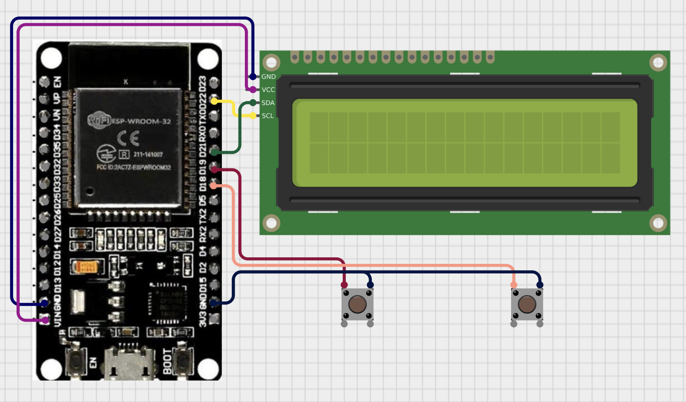

## ESP32 Chess Clock
Chess clock using an ESP32, LCD (I2C), and two physical buttons, configurable by WiFi.  
Time and increment are set through a browser via the ESP32 Access Point.
### Features
- Web interface for setting:
    - Base time (minutes)
    - Increment (Fischer delay)
- Two physical buttons (one per player)
- LCD display showing:
    - Player 1 time 
    - Player 2 time    
- Automatically starts when the first button is pressed
- Runs as standalone WiFi Access Point
###  Hardware Requirements
- ESP32 DevKit (any model)
- I2C LCD
- 2 × push buttons
### Web Interface
1. Connect to WiFi network configured in the 
2. Visit address printed in the *Serial Monitor* (default: `192.168.4.1`)
3. Enter:
    - Time in minutes    
    - Increment in seconds
    - Submit form
4. Press either button to start.
## Wiring Diagram

### Setup
#### **1. Clone the Repository**
```bash
git clone https://github.com/hszewczyk/ESP32-Chess-Clock.git
cd <ESP32-Chess-Clock>
```
#### **2. Open the Project in Arduino IDE**
1. Launch **Arduino IDE**
2. Open `I2C-Address/I2C-Address.ino` and run it
3. Input address of the I2C and Access Point credentials to `Chess-Clock/Chess-Clock.ino` file
4. Upload `Chess-Clock/Chess-Clock.ino` to ESP32 board
#### **3. Required External Libraries**
- [**LiquidCrystal_I2C**](https://github.com/johnrickman/LiquidCrystal_I2C)
